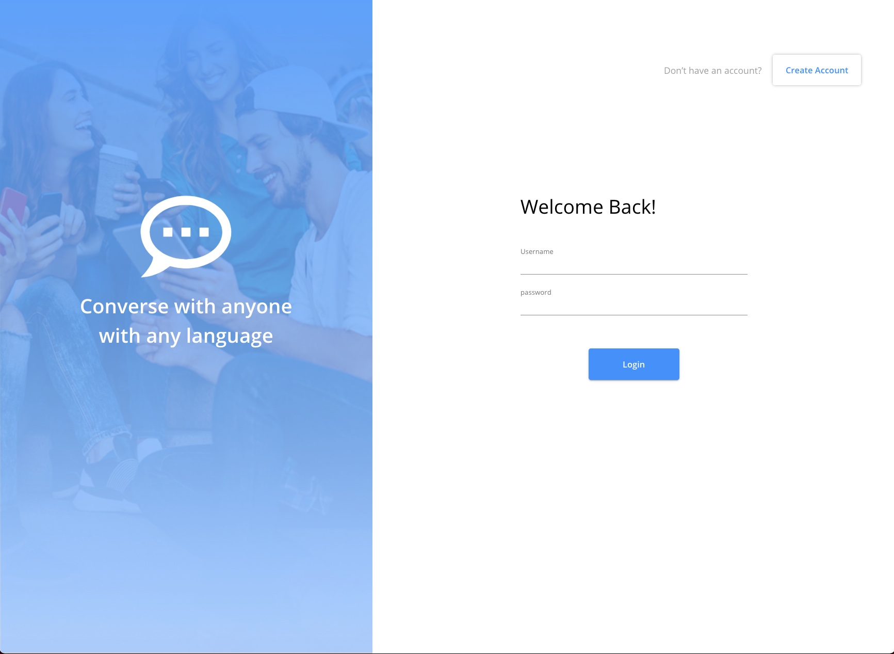
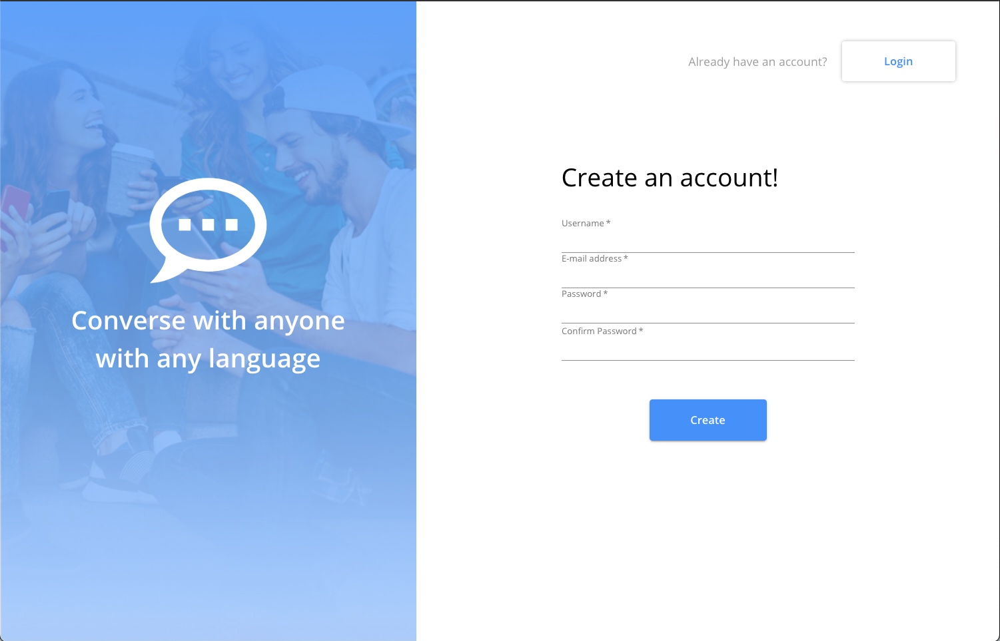
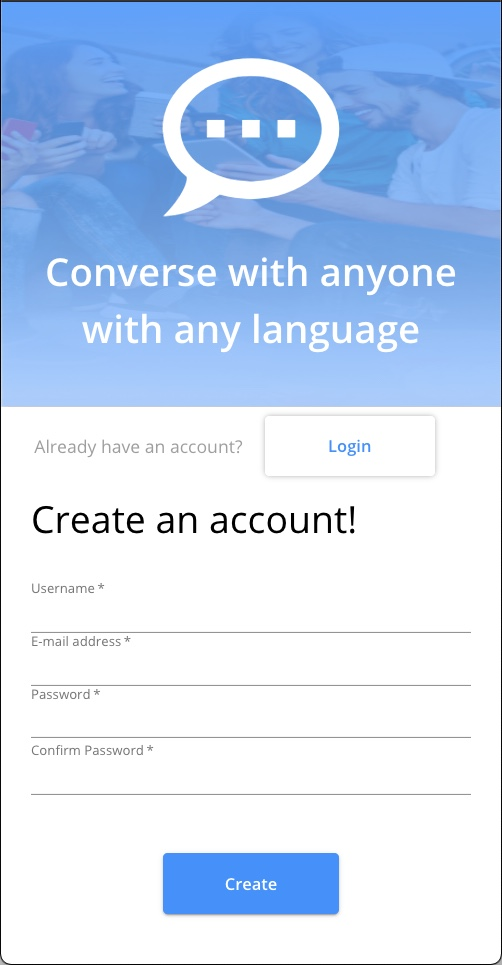

# Messenger

A one-to-one realtime chat app.

## Running Application Locally

```
psql
CREATE  DATABASE messenger;
\q

cd server
npm install

// seed the database
npm run seed

npm run dev
```

Create a .env file in the server directory and add your session secret

```
SESSION_SECRET = "your session secret"
```

# Screenshot for Issue 5

new signin page



mobile display


signup page




