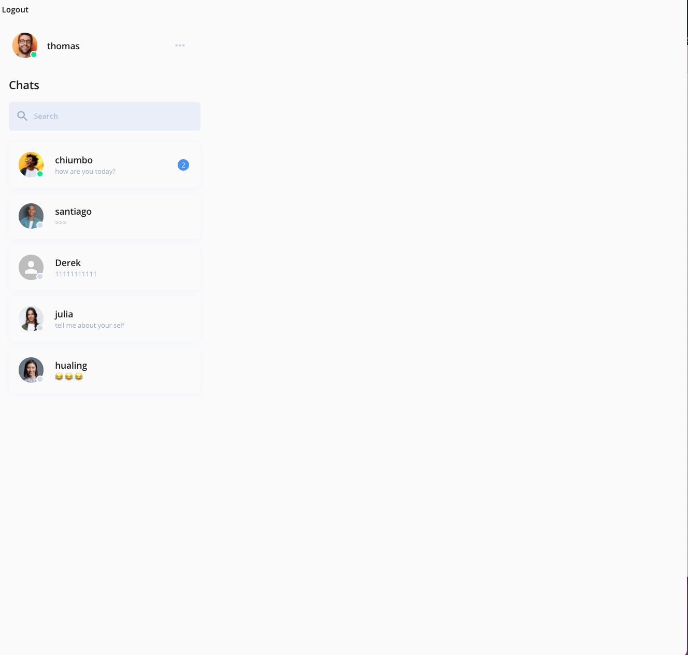
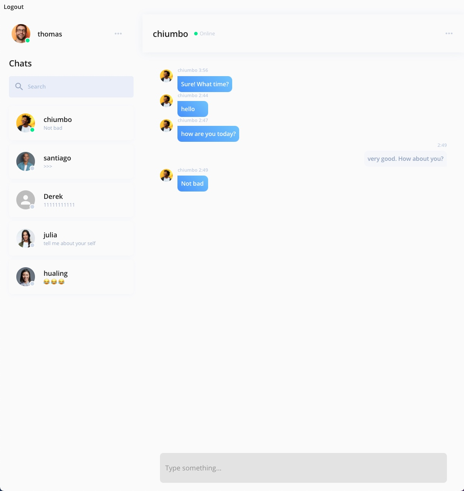

# Messenger

A one-to-one realtime chat app.

## Running Application Locally

```
psql
CREATE  DATABASE messenger;
\q

cd server
npm install

// seed the database
npm run seed

npm run dev
```

Create a .env file in the server directory and add your session secret

```
SESSION_SECRET = "your session secret"
```

# screenshot for issue 3 message status

when the user didn't activate a chat or activate chat is not the sender. The sidebar will count and display unread message



when the user activated a chat and the activated conversation is the sender, which me we are chat with the sender. At this time the side bar won't count the unread message.


